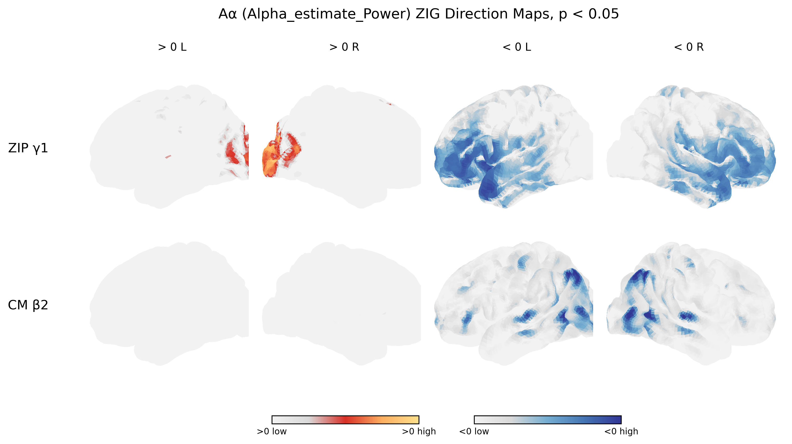
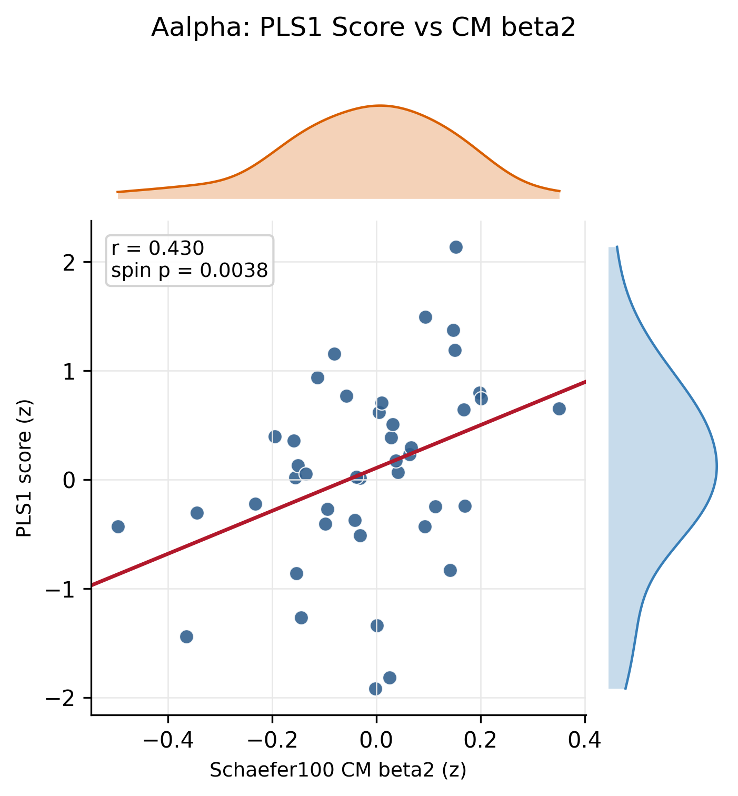
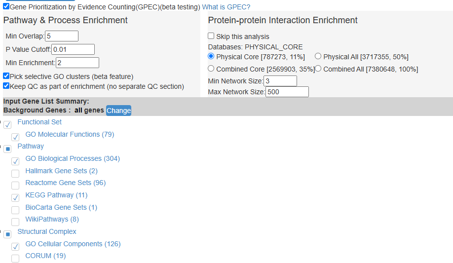
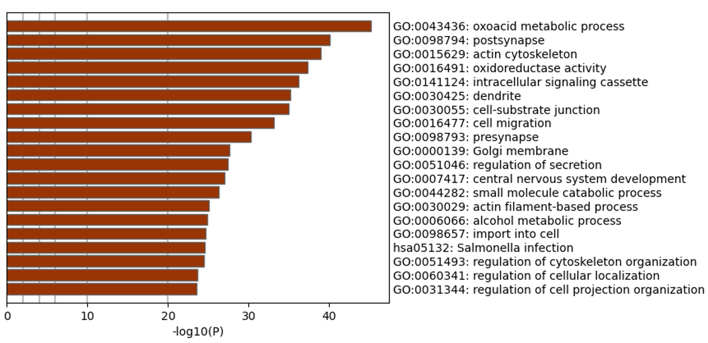
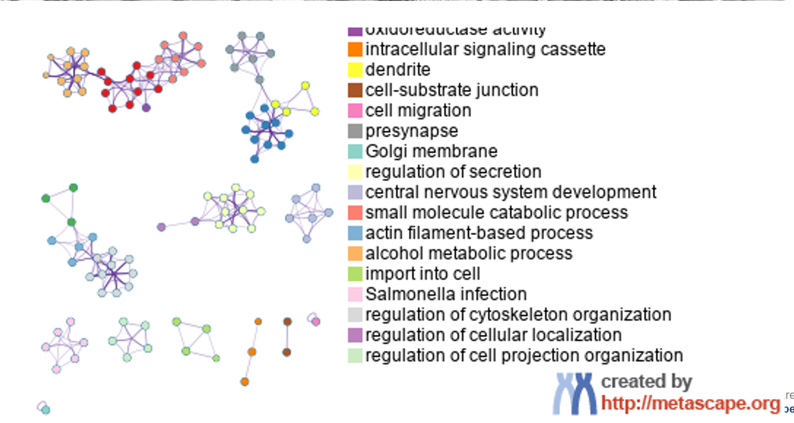
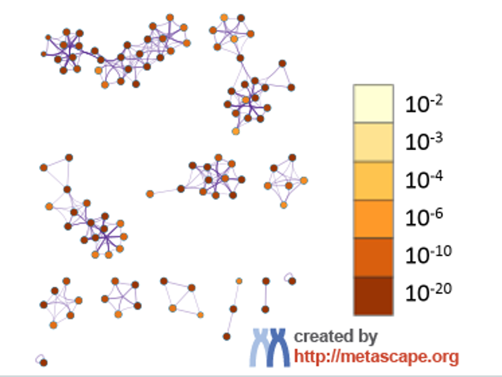

# XiAlpha beta2-AHBA PLS Pipeline

This folder contains a single-feature analysis pipeline for linking age-related Xi/Alpha cortical maps with AHBA gene expression. The current example uses `Alpha_estimate_Power`, referred to as Aalpha.

The workflow has two main modules:

1. `ZIG/CM`: fits vertex-wise age models and generates CM beta2 maps.
2. `PLS`: parcellates CM beta2 maps to Schaefer100, uses the left hemisphere to run AHBA PLS, and evaluates the PLS1 score association with a fixed-score spin test.

## Directory

```text
pipline
|-- code
|   |-- config.py
|   |-- utils.py
|   |-- zig_cm.py
|   |-- phenotype.py
|   |-- pls.py
|   |-- plots.py
|   |-- pipeline.py
|   `-- beta2_ahba_pls_pipeline.py
|
`-- example
    |-- run_alpha_power_example.py
    |-- data
    |   |-- vertex_matrices_processed
    |   |-- AHBA
    |   |-- parcellation
    |   `-- fsaverage
    |-- zig_cm
    |-- phenotype
    |-- pls
    `-- summary
```

## Code Modules

### `config.py`

Defines paths, default parameters, and the `SingleFeaturePipelineConfig` class.

Common fields:

```text
feature
short_name
output_root
vertex_matrix_root
ahba_mat
parcellation_dir
sphere_dir
parcel_count
n_bootstrap
n_spins
```

### `utils.py`

Provides shared helper functions:

```text
configure_import_paths()
write_json()
write_matrix_csv()
zscore_vector()
```

### `zig_cm.py`

Runs the vertex-wise ZIG/CM module for one feature.

Models:

```text
ZIP: logit(P(Y == 0)) = gamma0 + gamma1 * z_age
CM:  Y_nonzero = beta0 + beta1 * z_age + beta2 * z_age^2
```

Main outputs:

```text
*_zip_gamma1_raw_hemi-L/R.shape.gii
*_zip_gamma1_p_hemi-L/R.shape.gii
*_zip_gamma1_q_hemi-L/R.shape.gii
*_cm_beta2_raw_hemi-L/R.shape.gii
*_cm_beta2_p_hemi-L/R.shape.gii
*_cm_beta2_q_hemi-L/R.shape.gii
*_ZIG_vertex_statistics.csv
*_ZIG_summary.json
*_ZIG_ZIP_CM_direction_2x4.png
```

### `phenotype.py`

Parcellates bilateral CM beta2 GIFTI maps into Schaefer100 regional values.

Outputs:

```text
phenotype/cm_beta2_bilateral.csv
phenotype/cm_beta2_bilateral.npy
phenotype/cm_beta2_left.csv
phenotype/cm_beta2_left.npy
```

### `pls.py`

Runs AHBA PLS, writes gene-level outputs, and performs the fixed-score spin test.

Outputs:

```text
pls/<feature>/gene_weights.csv
pls/<feature>/top_genes_by_stability.csv
pls/<feature>/brain_scores.csv
pls/<feature>/PLS1score.csv
pls/<feature>/pls_summary.csv
pls/<feature>/pls_summary.json
pls/<feature>/genes_bootstrap_ratio_positive_gt3.csv
pls/<feature>/genes_bootstrap_ratio_negative_gt3.csv
pls/<feature>/spin_null_fixed_pls1_score_corr.csv
pls/<feature>/spin_test_fixed_pls1_summary.json
```

The positive and negative gene lists are sorted by `bootstrap_ratio` in descending order.

### `plots.py`

Creates the PLS1 score versus CM beta2 scatter plot.

Current output:

```text
pls/<feature>/figures/<feature>_PLS1_score_vs_cm_beta2_zscore.png
```

The figure uses z-scored CM beta2 and z-scored PLS1 scores. Extreme display outliers are hidden using an IQR rule for visualization only; the reported correlation and spin p-value are computed from the full ROI vectors.

### `pipeline.py`

Coordinates the full workflow:

```text
run_zig_cm_feature()
parcellate_cm_beta2()
run_pls_feature()
plot_pls1_beta2_scatter()
write pipeline_summary.json
```

### `beta2_ahba_pls_pipeline.py`

Compatibility entry point. It re-exports:

```python
SingleFeaturePipelineConfig
run_single_feature_pipeline
```

## Quick Start

Run the full Alpha Power example:

```powershell
cd <PIPELINE_ROOT>
& <PYTHON> example/run_alpha_power_example.py
```

This runs:

```text
vertex matrix -> ZIG/CM -> Schaefer100 parcellation -> AHBA PLS -> spin test -> figures
```

If ZIG/CM outputs already exist and only the PLS part needs to be rerun:

```powershell
cd <PIPELINE_ROOT>
& <PYTHON> example/run_alpha_power_example.py --skip-zig
```

Here `<PIPELINE_ROOT>` is the root directory of this pipeline folder, and `<PYTHON>` is the Python executable from the analysis environment.

The Alpha Power example uses the copied inputs under:

```text
<PIPELINE_ROOT>/example/data
```

For another dataset, either replace the files in `example/data` with the same naming convention or pass custom paths through `SingleFeaturePipelineConfig`. If an external plotting/helper repository is needed for the ZIG/CM stage, set it with the `MATLAB_TO_PY_MAPS_ROOT` environment variable rather than editing hard-coded local paths.

## Example Input

Example feature:

```text
feature = Alpha_estimate_Power
short_name = Aalpha
```

Vertex matrix input:

```text
<PIPELINE_ROOT>/example/data/vertex_matrices_processed/Alpha_estimate_Power
```

AHBA input:

```text
<PIPELINE_ROOT>/example/data/AHBA/ROIxGene_Schaefer100_INT_zscore.mat
```

Schaefer100 parcellation directory:

```text
<PIPELINE_ROOT>/example/data/parcellation
```

fsaverage sphere directory used for parcellation and spin permutations:

```text
<PIPELINE_ROOT>/example/data/fsaverage
```

## Example Output

Example output root:

```text
<PIPELINE_ROOT>/example
```

Main summary file:

```text
example/summary/pipeline_summary.json
```

Current Alpha Power example summary:

```text
PLS1 score vs CM beta2 correlation: r = 0.4304
fixed-score spin test: p = 0.0038
positive bootstrap-ratio > 3 genes: 2645
negative bootstrap-ratio < -3 genes: 1373
```

Gene-list sorting:

```text
positive: 10.6583 -> 3.0020
negative: -3.0029 -> -11.1408
```

## Figures

### ZIG/CM Direction Maps

This figure shows positive and negative direction maps for ZIP gamma1 and CM beta2, thresholded at `p < 0.05`.



Interpretation:

- The first row is ZIP gamma1, which models the association between age and the probability of zero-valued vertices.
- The second row is CM beta2, which models the quadratic age effect among nonzero vertex values.
- The first two columns show positive coefficients.
- The last two columns show negative coefficients.
- Negative CM beta2 values are consistent with a concave age trajectory, such as an inverted-U-like or downward-curving lifespan pattern.

### PLS1 Score vs CM Beta2

This figure shows the spatial association between the Schaefer100 left-hemisphere CM beta2 map and the AHBA-derived PLS1 score map. Both axes are z-scored for visualization.



Interpretation:

- X-axis: z-scored CM beta2 values across 50 left-hemisphere Schaefer100 ROIs.
- Y-axis: z-scored PLS1 scores across the same ROIs.
- `r`: spatial correlation between the real PLS1 score map and the CM beta2 map.
- `spin p`: fixed-score spin-test p-value. The real PLS1 score map is fixed, while the bilateral CM beta2 map is spatially rotated to generate the null distribution.
- Marginal density curves show the distribution of each variable.

## Mathematical Details

This section describes the formulas used by the pipeline in the notation of the current data.

### Data notation

For one feature, the processed fsaverage10k vertex matrix is:

```text
M in R^(N x (1 + V))
```

where:

```text
N = number of subjects
V = number of cortical vertices across both hemispheres
M[:, 0] = subject age
M[:, 1:] = vertex-wise feature values
```

For the current Alpha Power example:

```text
N = 1965
V = 20484
```

Age is z-scored before vertex-wise model fitting:

```text
z_age_i = (age_i - mean(age)) / sd(age)
```

For subject `i` and vertex `v`, the feature value is:

```text
y_iv = M[i, 1 + v]
```

### ZIP model: zero probability

The ZIP part models whether a vertex value is zero or near-zero. The current zero definition is:

```text
zero_iv = 1 if abs(y_iv) <= 1e-8
zero_iv = 0 otherwise
```

For each vertex `v`, the zero-probability model is:

```text
zero_iv ~ Bernoulli(pi_iv)
logit(pi_iv) = gamma0_v + gamma1_v * z_age_i
```

Equivalently:

```text
pi_iv = 1 / (1 + exp(-(gamma0_v + gamma1_v * z_age_i)))
```

The output coefficient is:

```text
gamma1_v
```

Interpretation:

```text
gamma1_v > 0: older age is associated with a higher probability of zero values at vertex v
gamma1_v < 0: older age is associated with a lower probability of zero values at vertex v
```

The pipeline saves:

```text
*_zip_gamma1_raw_hemi-L/R.shape.gii
*_zip_gamma1_p_hemi-L/R.shape.gii
*_zip_gamma1_q_hemi-L/R.shape.gii
```

### CM model: nonzero conditional mean

The CM part models the age trajectory among nonzero values only. For each vertex `v`, the model is:

```text
y_iv = beta0_v + beta1_v * z_age_i + beta2_v * z_age_i^2 + epsilon_iv
```

but only subjects with nonzero finite values at that vertex are included:

```text
abs(y_iv) > 1e-8 and isfinite(y_iv)
```

The output coefficient used in the downstream PLS analysis is:

```text
beta2_v
```

Interpretation:

```text
beta2_v > 0: convex age trajectory at vertex v
beta2_v < 0: concave age trajectory at vertex v
```

A negative `beta2_v` can be consistent with an inverted-U-like or downward-curving age trajectory, but the exact trajectory should be interpreted together with the fitted curve and data distribution.

The pipeline saves:

```text
*_cm_beta2_raw_hemi-L/R.shape.gii
*_cm_beta2_p_hemi-L/R.shape.gii
*_cm_beta2_q_hemi-L/R.shape.gii
```

### FDR correction

For vertex-wise p-values, the pipeline applies Benjamini-Hochberg FDR correction:

```text
q_(k) = min_{j >= k} p_(j) * m / j
```

where:

```text
p_(j) = j-th ordered p-value
m = number of valid tests
q_(k) = FDR-adjusted p-value
```

### Parcellation to Schaefer100

The CM beta2 vertex map is averaged within each Schaefer100 parcel:

```text
Y_r = mean(beta2_v for vertices v in parcel r)
```

This gives:

```text
Y_bilateral in R^100
Y_left in R^50
```

The AHBA matrix only contains left-hemisphere ROIs in the current data, so PLS uses:

```text
Y = Y_left in R^(50 x 1)
```

### AHBA PLS model

The AHBA gene-expression matrix is:

```text
X in R^(R x G)
```

where:

```text
R = 50 left-hemisphere Schaefer100 ROIs
G = number of AHBA genes
```

In the current example:

```text
R = 50
G = 15745
```

Before PLS, the pipeline z-scores each gene column and the phenotype vector across ROIs:

```text
X_z[:, g] = (X[:, g] - mean(X[:, g])) / sd(X[:, g])
Y_z = (Y - mean(Y)) / sd(Y)
```

The cross-covariance vector is:

```text
c = X_z^T Y_z / (R - 1)
```

The PLS1 gene-weight vector is:

```text
w = c / ||c||
```

The PLS1 brain score for each ROI is:

```text
s = X_z w
```

where:

```text
s in R^50
```

The sign of `w` and `s` is flipped if needed so that:

```text
corr(s, Y_z) >= 0
```

The reported PLS1 score versus CM beta2 correlation is:

```text
r = corr(s, Y)
```

Because the current pipeline uses a single phenotype vector (`Y` has one column), this implementation outputs one effective PLS component. The reported explained covariance ratio is therefore:

```text
explained_covariance_ratio = 1.0
```

This means that all modeled X-Y covariance in this single-component implementation is assigned to PLS1; it does not mean that PLS1 explains all biological variation in the brain phenotype.

### Bootstrap ratio

The pipeline estimates gene-weight stability using ROI bootstrap resampling.

For bootstrap iteration `b`:

```text
sample R ROIs with replacement
compute w_b from the resampled X_z and Y_z
align sign so that dot(w_b, w) >= 0
```

The bootstrap standard error for gene `g` is:

```text
SE_g = sd(w_b,g across bootstrap samples)
```

The bootstrap ratio for gene `g` is:

```text
BR_g = w_g / SE_g
```

The gene lists are selected as:

```text
positive genes: BR_g > 3
negative genes: BR_g < -3
```

Both gene lists are sorted by `bootstrap_ratio` in descending order:

```text
positive: largest positive BR -> smaller positive BR
negative: BR closest to -3 -> most negative BR
```

### Fixed-score spin test

The spin test evaluates whether the spatial correlation between the real PLS1 score map and CM beta2 map is stronger than expected under spatially rotated cortical maps.

The real statistic is:

```text
r_real = corr(s, Y_left)
```

For spin `k`, the bilateral CM beta2 map is rotated:

```text
Y_spin,k = spin_k(Y_bilateral)
```

Then the left-hemisphere part is used:

```text
Y_spin_left,k = first 50 ROIs of Y_spin,k
```

The null correlation is:

```text
r_null,k = corr(s, Y_spin_left,k)
```

The one-sided spin p-value is:

```text
p_spin = (1 + number of r_null,k >= r_real) / (1 + n_spins)
```

In the current example:

```text
n_spins = 5000
n_bootstrap = 1000
```

This is a fixed-score spin test: the PLS1 score map `s` is kept fixed, and only the CM beta2 phenotype map is spatially rotated.

## Scientific Interpretation

This pipeline asks:

```text
Is the spatial pattern of age-related CM beta2 associated with a specific AHBA gene-expression pattern?
```

PLS inputs:

```text
X = AHBA gene expression, 50 ROIs x genes
Y = CM beta2 phenotype, 50 ROIs x 1
```

The PLS1 score is an ROI-level score that indicates how strongly each brain region expresses the PLS1 gene-expression pattern. Correlating the PLS1 score map with the CM beta2 map tests whether this gene-expression pattern spatially aligns with the age-curvature phenotype.

The spin test controls for spatial autocorrelation across cortical regions.

Gene-level interpretation mainly uses:

```text
gene_weights.csv
genes_bootstrap_ratio_positive_gt3.csv
genes_bootstrap_ratio_negative_gt3.csv
```

The `bootstrap_ratio` is used as a gene-stability metric. Larger absolute values indicate genes with more stable contributions to the PLS1 axis across bootstrap resampling.

## Notes

- The pipeline processes one feature at a time.
- The current example uses `Alpha_estimate_Power`.
- Outputs are organized by function: `zig_cm`, `phenotype`, `pls`, and `summary`.
- Use `--skip-zig` when ZIG/CM outputs already exist and only PLS needs to be rerun.
- To process another feature, edit `feature` and `short_name` in `example/run_alpha_power_example.py`.

## Metascape Enrichment

Gene enrichment is the final downstream interpretation step after PLS. It is not used to fit the PLS model or compute the spin-test p-value. In this example, Metascape is used to annotate genes selected from the PLS1 bootstrap-ratio results.

Typical inputs:

```text
pls/<feature>/genes_bootstrap_ratio_positive_gt3.csv
pls/<feature>/genes_bootstrap_ratio_negative_gt3.csv
```

For interpretation, positive and negative PLS1 gene sets should usually be submitted separately because they represent opposite directions on the PLS1 gene-weight axis. The submitted gene list contains the genes passing the stability threshold:

```text
positive set: bootstrap_ratio > 3
negative set: bootstrap_ratio < -3
```

### Metascape Setup

The example enrichment was run through the Metascape web interface:

```text
https://metascape.org/gp/index.html#/main/step3
```

The selected enrichment sources were:

```text
GO Molecular Functions
GO Biological Processes
GO Cellular Components
KEGG Pathway
```

The setup used:

```text
background genes = all genes
minimum overlap = 5
p-value cutoff = 0.01
minimum enrichment = 2
selective GO clustering = enabled
GPEC gene prioritization = enabled
```



This panel documents the enrichment databases and thresholds. Keeping this screenshot is useful because enrichment results depend strongly on the selected ontology sources, background set, and filtering thresholds.

### Enrichment Bar Plot



The bar plot ranks enriched terms by `-log10(P)`. Larger bars indicate stronger statistical enrichment among the submitted PLS1 genes. In this example, the most enriched terms include metabolic, synaptic, cytoskeletal, intracellular signaling, dendritic, secretion-regulation, and central-nervous-system-development related annotations.

The enrichment test asks whether genes from the submitted PLS1 list are over-represented in a known pathway or ontology term compared with the background gene universe. A simple way to describe the logic is:

```text
observed overlap = genes in the PLS1 list that also belong to a GO/KEGG term
expected overlap = overlap expected by chance from the background genes
```

Metascape reports terms where the observed overlap is larger than expected after its statistical filtering and clustering steps.

### Pathway Network



The network view groups enriched terms by similarity. Each node is an enriched term, and edges connect terms sharing many genes. Nodes with the same color belong to the same representative pathway/process cluster. This view helps reduce a long enrichment list into broader biological themes.

In this example, the network suggests that the PLS1 gene set is not dominated by a single isolated annotation. Instead, enriched terms form several related clusters, including synaptic structure, dendrite/cytoskeleton organization, cellular localization, secretion, signaling, and metabolic processes.

### Network Colored by P Value



This is the same enrichment network, but node color represents statistical significance. Darker orange/brown nodes have smaller p-values and therefore stronger enrichment evidence. This figure is useful for showing both the structure of the enrichment network and which clusters carry the strongest statistical signal.

### Suggested Reporting Text

For a manuscript or thesis, this step can be summarized as:

```text
Genes with stable positive or negative PLS1 contributions were selected using a bootstrap-ratio threshold of |BR| > 3 and submitted separately to Metascape for functional enrichment analysis. Enrichment was tested against all background genes using GO Molecular Function, GO Biological Process, GO Cellular Component, and KEGG Pathway annotations, with minimum overlap = 5, p-value cutoff = 0.01, and minimum enrichment = 2. Enriched terms were visualized as ranked -log10(P) bar plots and as pathway/process networks, where connected nodes indicate gene-overlap similarity among terms.
```
